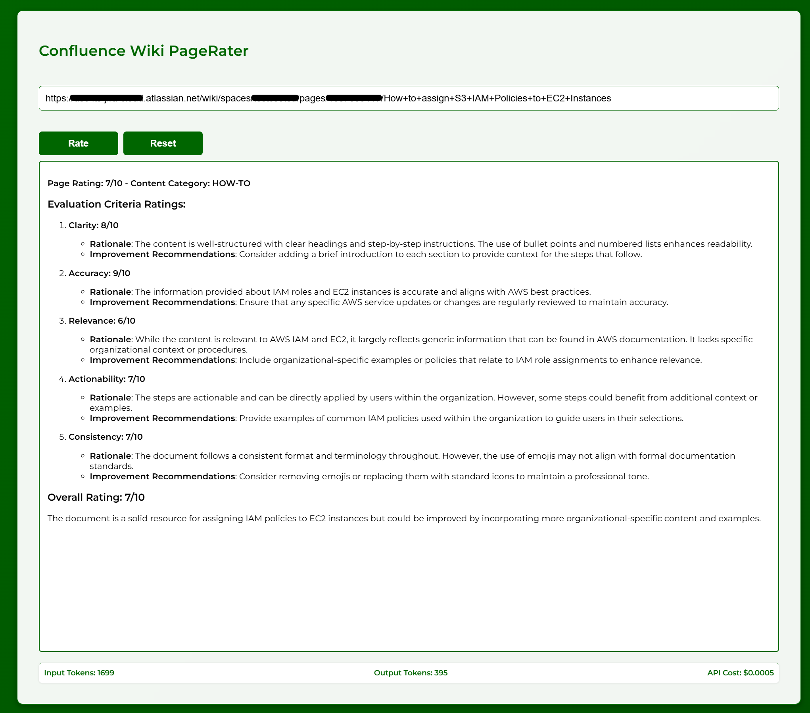

# Confluence Cloud PageRater `cc-pagerater`

`cc-pagerater` is a web application that evaluates the quality of Confluence wiki pages based on predefined attributes. It provides a structured score along with recommendations for improvement, helping teams maintain high-quality documentation.

## Features
- Fetches and analyzes content from Confluence pages using a provided URL.
- Rates documents on key attributes such as Clarity, Accuracy, Completeness, Readability, and Structure.
- Generates an overall score (1-10) with actionable recommendations.
- Uses an Azure AI Large Language Model (LLM) to evaluate content and provide feedback.
- Allows for customization of rating criteria.
- Caches rating responses in a SQLite database with configurable TTL.




## How It Works
1. Users input a Confluence page URL.
2. PageRater extracts the page content via the Confluence API.
3. The extracted content is passed to an Azure AI LLM for evaluation.
4. The LLM assigns ratings and provides improvement suggestions.
5. Users receive a structured score report.
6. Rated pages are cached in a SQLite database to optimize performance.

## Configuration
PageRater is configured using `config.toml` and `.env` files:

### `.env` (Sensitive Credentials)
```
AZURE_AI_KEY=your-azure-key
CONFLUENCE_API_TOKEN=your-api-token
```

### `config.toml` (Application Configuration)
```toml
[webapp]
title = "Wiki PageRater"
host  = "0.0.0.0"
port  = 8000

[confluence]
wiki_url = "https://my.atlassian.net/wiki"
username = "your-email@example.com"
space = "your-space"

[azure-ai]
endpoint = "https://aai-your-instance.services.ai.azure.com/models"

[azure-ai.model]
deployment_name = "your-model-name"
max_tokens = 1000
temperature = 0.1
top_p = 0.1
input_token_cost = 0.15
output_token_cost = 0.6

[prompts]
system_page_rating = "You are a document rating assistant. You have been trained to evaluate content in HTML format based on specific criteria."
user_page_rating = "..."  # Full prompt is provided in config.toml

[cache]
database = "cc_page_rater_cache.db"
ttl_seconds = 2592000  # Cache expiration time
```

## Installation
### Prerequisites
- For Linux hosts, privileges on local machine to change ownership on mounted cache directory
- Confluence API Token
- Azure OpenAI or other LLM API key

### Setup
1. Create environment file:
   Refer to the instructions above or `.env.sample` in the Git repository.

2. Create application configuration file:
   Refer to the instructions above or `config.toml.sample` in the Git repository.

3. Create a `cache` directory for sqlite and assign required ownership:
   ```bash
   mkdir cache
   sudo chown 65000:65000 cache
   ```
   **NOTE:** The above ownership is required as the application's container image uses a non-root user with UID=GID=65000 and needs to write to the mounted cache directory.

## Usage
### Running the App
Run the containerized web application:
```bash
docker run -d -u 65000:65000 \
-v ./config.toml:/app/config.toml \
-v ./.env:/app/.env \
-v ./cache:/app/cache \
-p 8000:8000 \
ghcr.io/cybergavin/cc-pagerater:latest
```

### Accessing the API Documentation
Once the app is running, you can access the FastAPI interactive docs at `http://<host>:8000/docs`